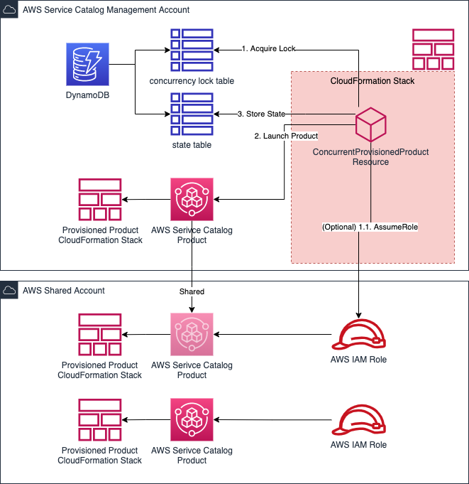

# Concurrent AWS ServiceCatalog Provisisioned Product Resource Provider

This repository implements an AWS CloudFormation Resource Provider,
which **concurrently** provisions an AWS Service Catalog Product.
Optionally this can be done **cross-account** by providing a role ARN to be assumed.

# ProServe::ServiceCatalog::ConcurrentProvisionedProduct

See example usage of the resource below. Detailed documentation can be found in the [/docs](docs) folder.

This resource fronts the provisioning of an AWS Service Catalog product using CloudFormation with a Client Lock.
Whenever a provisioned product is already under change on the same product, the resource provider takes care of retrying with proper backoff configurations.

Hence, this resource can be used in multiple use cases. One of the most prominent use cases is **extending the AWS Control Tower Account Factory** with a custom AWS Service Catalog Product.
Details, see in the use case specific [README](control-tower-sc-extension/README.md)

## Quickstart

You can use the following link to deploy the CloudFormation resource provider directly into your AWS account. Ensure you are logged into the AWS Console before following it.

[Quickstart CloudFormation Link](https://console.aws.amazon.com/cloudformation/home?region=eu-west-1#/stacks/new?templateURL=https:%2F%2Fs3.amazonaws.com%2Faws-enterprise-jumpstart%2Faws-concurrent-provisioned-product%2Fcfn-provider-registration.yaml)

## Usage

```yaml
  TestScProductA:
    Type: ProServe::ServiceCatalog::ConcurrentProvisionedProduct
    Properties:
     RoleArn: arn:aws:iam::123456789012:role/ScTestRole
     ProvisionedProductName: CfnTestA
     ProductName: test
     ProvisioningArtifactName: v1.0.1
     OutputKey: CloudformationStackARN
     ProvisioningParameters:
     - Key: Test
       Value: Hallo
```

## Architecture



## Future Work

* Introduce type configurations to allow usage of custom named DynamoDB tables.

## Hints

* While code samples in this repository has been tested and believe it works well, as always, be sure to test it in your environment before using it in production!
* Double check the AWS IAM role permissions. In order to follow the least privilege strategy adapt the permissions as required. To use AWS Service Catalog out of the box, the default permissions are widely open.

The RPDK will automatically generate the correct resource model from the schema whenever the project is built via Maven. You can also do this manually with the following command: `cfn generate`.

> Please don't modify files under `target/generated-sources/rpdk`, as they will be automatically overwritten.

The code uses [Lombok](https://projectlombok.org/), and [you may have to install IDE integrations](https://projectlombok.org/setup/overview) to enable auto-complete for Lombok-annotated classes.

## Security

See [CONTRIBUTING](CONTRIBUTING.md#security-issue-notifications) for more information.

## License

This library is licensed under the MIT-0 License. See the LICENSE file.
