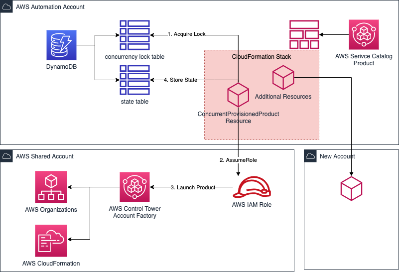

# AWS Control Tower Account Factory Extension

The AWS Control Tower Account Factory is an AWS Service Catalog Product itself. This AWS CloudFormation resource provider can
be used to concurrent vend account from Control Tower. The encapsulation CloudFormation Stack holds this resource.
The Account Id as output value can be used to provision other resources required within the newly created account.

This could be custom config rules, or VPC blueprints, Route53 Hosted Zones, ... 

This works great together with this AWS CloudFormation Resource Provider ([https://github.com/aws-samples/aws-cloudformation-stack-instances](https://github.com/aws-samples/aws-cloudformation-stack-instances)) which creates stack instances in defined regions concurrently.
See an example and architecture diagram below. This solution can be integrated into IT workflow management systems, such as Service Now.

Hence, the whole process of requesting AWS Accounts can be **highly automated** this way. This setup **reduces lead times and accelerates large scale cloud projects, like mass migrations**.  

## Quickstart

1. Deploy `quickstart/cfn-provider-registration.yaml` AWS Cloudformation stack
2. Deploy `control-tower-sc-extension/ct-wrapper-quickstart.yaml`
3. Grant yourself access to `Account Blueprints` AWS Service Catalog portfolio
4. Grant access to the `AWS Control Tower Account Factory Portfolio` portfolio for AWS IAM Role `sc-concurrent-pp-CfnResourceProviderExecutionRole-*` created through step 1
5. Note down current provisioning artifact id and product id for `AWS Control Tower Account Factory` product (e.g. `pa-1234566`)
6. Launch AWS Service Catalog Product `Demo Account Type` with parameters of your choice to initialize a new account provisioning process via Control Tower. The custom resource provide takes care of concurrency.

## Example Account Template

```yaml
Description: Development Account

Parameters:
  AccountName:
    Type: String
  AccountEmail:
    Type: String

  Account:
    Type: ProServe::ServiceCatalog::ConcurrentProvisionedProduct
    Properties:
      ProvisionedProductName: !Ref AccountName
      ProductId: prod-<account-factory-product-id>
      ProvisioningArtifactId: pa-<account-factory-product-artifact-id>
      OutputKey: AccountId
      ProvisioningParameters:
      - Key: AccountEmail
        Value: !Ref AccountEmail
      - Key: AccountName
        Value: !Ref AccountName
      - Key: ManagedOrganizationalUnit
        Value: Core
      - Key: SSOUserEmail
        Value: '{{resolve:ssm:/org/sso/admin-email}}'
      - Key: SSOUserFirstName
        Value: Control Tower
      - Key: SSOUserLastName
        Value: Admin

  ConnectedVpc:
    Type: ProServe::Cloudformation::StackInstances
    Properties:
      StackSetName: my-corp-connected-vpc
      StackInstances:
        DeploymentTargets:
          Accounts:
          - !GetAtt Account.OutputValue
        Regions:
        - eu-west-1
        - us-east-1
      OperationPreferences:
        FailureToleranceCount: 0
        MaxConcurrentCount: 1
        RegionConcurrencyType: PARALLEL
      Capabilities:
      - CAPABILITY_IAM
```
## Architecture

